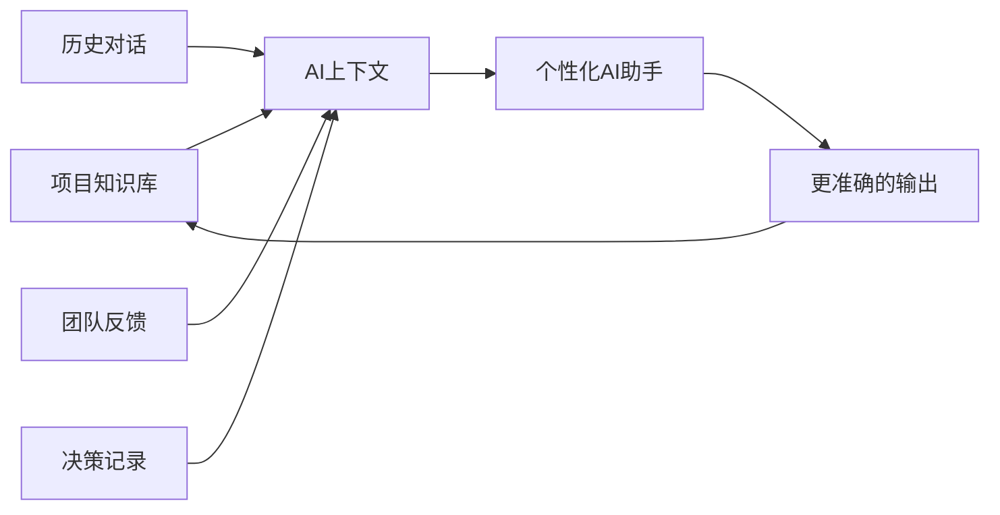

# 止观AI项目 - 团队+AI协同工作体系（完整方案）

> ⚠️ **本方案已被取代 · 2026-09-06 宗国法师决定**
>
> **取代文件**：`01_项目管理\止观AI人机协作贯通方案讨论稿V2.md`
>
> **取代原因**：本方案设计的是"人类团队协作为主、AI 为辅"（14 人攻坚小组＋会议体系＋权限矩阵＋KPI）；项目实际演进为"AI 执行为主、人审定"——VR 视觉闭环攻坚、硬件选型判决、代码实现均由 AI 助理完成，实际推进者为宗国法师一人＋AI。范式不同，非迭代可解决。
>
> **另一原因**：本方案人员角色表为 2026-01 旧班子（李晓玉、郭永安等），2026-08 已调整为 8 人（法师、黄昇平、吴海峰、赵渊、张彤、温伟东、李欢、罗涛），信息已过期。
>
> **保留价值**：本方案不是错的，是它服务的那个阶段过去了。原地归档保留，作为"项目当时如何设想协作"的纪事素材，可供《行者无疆》与案例库引用。以下正文一律维持原样，不再更新。

---

> 基于项目已有资料 + 三份会议纪要（01-13周会、01-15 Demo讨论、01-16调研会议）整理
>
> 创建日期：2026-01-16

---

## 一、项目概览

### 1.1 项目定位

```
止观AI项目
├── 核心价值：传承禅法 + AI技术 + 公益性质
├── 产品方向：VR + 脑电 + 止观禅定
├── 竞争优势：有传承的禅法 + 寺院信用背书
└── 技术策略：技术跟随者，使用成熟科技
```

### 1.2 项目当前状态

| 维度 | 状态 | 说明 |
|-----|------|------|
| **项目周期** | 发起不到2个月 | 2025年11月启动 |
| **核心产出** | 已完成 | 项目方案、计划书、商业计划、Demo设计、技术方向文档 |
| **团队状态** | 已组建 | 攻坚小组14人，已召开多次会议 |
| **当前重点** | 进行中 | 组织化建构与协作、调研、Demo推进、知识库建设 |

### 1.3 已有会议共识

```
会议共识体系
├── 01-13 周会：确定Demo分工、调研安排、知识库负责人
├── 01-15 Demo讨论：明确下一步计划、产品定位、路线图
└── 01-16 调研会议：调研目的、范围、方法、分工
```

---

## 二、团队组织架构与AI配合机制

### 2.1 核心团队结构（攻坚小组14人）

```
止观AI项目组织架构
                    ┌─────────────────────────┐
                    │   项目决策委员会         │
                    │ (宗国法师、郭永安、Vin)  │
                    │   - 战略方向             │
                    │   - 重大决策             │
                    │   - 资源分配             │
                    └────────────┬────────────┘
                                 │
                    ┌────────────▼────────────┐
                    │   项目总负责人          │
                    │   (宗国法师)            │
                    │   - 全局协调              │
                    │   - AI统筹               │
                    │   - 里程碑管理           │
                    └────────────┬────────────┘
        ┌────────────────────────┼────────────────────────┐
        │                        │                        │
   ┌────▼────┐             ┌─────▼─────┐            ┌─────▼─────┐
   │产品研发 │             │市场调研   │            │运营与   │
   │团队     │             │团队       │            │知识库   │
   └─────────┘             └───────────┘            └───────────┘
```

### 2.2 详细分工与AI配合

| 领域 | 负责人 | 核心职责 | AI配合角色 |
|-----|-------|---------|-----------|
| **项目总负责** | 宗国法师 | 项目全局统筹、战略决策、知识库总负责 | AI辅助：战略分析 |
| **项目总助理** | 李晓玉 | 协调沟通、事务处理、前期资料梳理 | AI辅助：任务跟踪 |
| **技术研发** | 温伟东 | 技术研发负责人、技术选型与架构 | AI辅助：技术分析、方案评估 |
| **调研总负责** | 郭永安 | 调研统筹、行业动态汇总 | AI辅助：信息收集、报告生成 |
| **Demo小组** | 李欣妍 | Demo推进、3D视频制作 | AI辅助：场景设计、视频脚本 |
| | 合剑卿 | VR技术方案 | AI辅助：技术选型对比 |
| | 丁思昊 | 模型处理、交互设计 | AI辅助：设计建议 |
| **市场调研** | 罗涛 | 冥想疗愈APP调研 | AI辅助：竞品分析 |
| | 石华平 | 冥想类APP调研 | AI辅助：功能对比 |
| | 黄生平 | 寺院实地考察 | AI辅助：考察报告 |
| | 华平师兄 | 用户访谈方案 | AI辅助：访谈提纲、分析 |
| | 用户555727 | VR/AR产品、行业动态整合 | AI辅助：产品分析、趋势分析 |
| | 李娅妮 | 外部资料调研、内部信息整理 | AI辅助：资料整理 |
| **技术调研** | 伟东 | 技术深度研究 | AI辅助：技术资料分析 |
| **知识库** | 宗国法师（总负责） | 知识库搭建、权限管理 | AI辅助：内容整理、智能搜索 |
| | 李晓玉 | 前期资料梳理 | AI辅助：资料分类 |
| | 李娅妮 | 外部资料调研、内部信息整理迭代 | AI辅助：内容更新 |

### 2.3 AI角色矩阵

```
AI在项目中的角色定位
├── 助手角色（执行层面）
│   ├── 信息收集：自动搜索、分类、去重
│   ├── 内容整理：文档格式化、知识库更新
│   ├── 报告生成：周报、调研报告、数据分析
│   └── 辅助决策：数据对比、风险评估
│
├── 协作角色（沟通层面）
│   ├── 会议纪要：自动记录、整理
│   ├── 任务跟踪：进度更新、提醒
│   ├── 知识共享：智能检索、问答
│   └── 语言翻译：跨团队沟通
│
└── 学习角色（优化层面）
    ├── 上下文学习：理解项目风格
    ├── 反馈优化：根据使用调整输出
    └── 经验沉淀：历史对话分析
```

---

## 三、跨部门协同工作流程

### 3.1 核心工作流：调研-产品-Demo-运营-知识库闭环

```
┌────────────────────────────────────────────────────────────────────┐
│              止观AI项目核心工作流（五大模块闭环）                  │
└────────────────────────────────────────────────────────────────────┘

调研模块                  产品/Demo模块              知识库模块
  ┌─────────┐                ┌─────────┐              ┌─────────┐
  │ 行业扫描 │──────┐        │ 产品定义 │──────┐      │ 资料收集 │
  │ 竞品分析 │      │        │ Demo设计 │      │      │ 知识沉淀 │
  │ 用户研究 │      ▼        │ 开发实施 │      ▼      │ 智能检索 │
  │ 技术调研 │    ┌─────────▼──────┐    ┌───────▼──────────┐
  │ AI辅助   │    │   产品/Demo评审会│    │   知识库评审会   │
  └─────────┘    └─────────┬──────┘    └───────┬──────────┘
                           │                    │
                           ▼                    ▼
                      ┌─────────┐          ┌─────────┐
                      │ 交付物  │          │ 成果输出│
                      │ PRD     │          │ 可共享  │
                      │ 原型    │          │ 可追溯  │
                      └────┬────┘          └────┬────┘
                           │                    │
        ┌──────────────────┼────────────────────┼──────────────────┐
        │                  │                    │                  │
        ▼                  ▼                    ▼                  ▼
    ┌─────────┐        ┌─────────┐        ┌─────────┐        ┌─────────┐
    │ 飞书表格 │        │ 飞书文档 │        │ 知识库   │        │ 会议纪要 │
    │ 实时更新 │        │ 协作编辑 │        │ 权限管理 │        │ AI记录   │
    └─────────┘        └─────────┘        └─────────┘        └─────────┘
           │                  │                  │                  │
           └──────────────────┼──────────────────┼──────────────────┘
                              │                  │
                              ▼                  ▼
                        ┌─────────────┐    ┌─────────────┐
                        │   周会同步  │    │   评审汇报  │
                        └─────────────┘    └─────────────┘
                              │                  │
                              └────────┬─────────┘
                                       ▼
                              ┌──────────────────┐
                              │  AI知识库更新    │
                              │  持续学习优化    │
                              └──────────────────┘
```

### 3.2 模块间协作规则

| 协作关系 | 输出方 | 接收方 | 交付物 | 同步机制 |
|---------|-------|-------|-------|---------|
| **调研→产品** | 调研组 | Demo组 | 调研报告、竞品分析、需求清单 | 调研评审会 |
| **调研→知识库** | 调研组 | 知识库组 | 调研文档、行业动态 | 飞书共享 |
| **产品→Demo** | 产品组 | Demo组 | PRD、设计稿 | 产品评审会 |
| **Demo→知识库** | Demo组 | 知识库组 | 技术文档、Demo成果 | 飞书共享 |
| **知识库→全员** | 知识库组 | 全员 | 可查询的知识 | 飞书搜索 |
| **全员→决策** | 全员 | 决委会 | 工作进展、问题 | 周会、评审会 |

### 3.3 调研阶段工作流（当前重点）

```
调研阶段工作流（8周计划）
┌─────────────────────────────────────────────────────────────────────┐
│ Week 1-2：基础设施搭建                                          │
│   ├─ 搭建飞书协作空间                                           │
│   ├─ 创建调研数据表（公司/产品/技术动态）                        │
│   ├─ 配置AI工具（Claude、国内大模型）                            │
│   └─ 团队AI使用培训                                             │
├─────────────────────────────────────────────────────────────────────┤
│ Week 3-4：信息收集与初步分析                                     │
│   ├─ VR/AR产品调研（用户555727）                                 │
│   ├─ 脑环设备调研（郭永安）                                     │
│   ├─ 冥想APP调研（罗涛、石华平、黄生平）                        │
│   ├─ 用户访谈启动（华平师兄）                                    │
│   └─ 行业动态收集（用户555727）                                  │
├─────────────────────────────────────────────────────────────────────┤
│ Week 5-6：深度调研与需求验证                                     │
│   ├─ 竞品深度分析                                               │
│   ├─ 用户访谈分析                                               │
│   ├─ 技术可行性评估                                             │
│   └─ 假设验证设计                                               │
├─────────────────────────────────────────────────────────────────────┤
│ Week 7-8：综合分析与产品定义                                     │
│   ├─ 调研报告整合                                               │
│   ├─ 功能优先级排序（ICE评分）                                  │
│   ├─ MVP方案设计                                                │
│   └─ 第一阶段总结报告                                           │
└─────────────────────────────────────────────────────────────────────┘
```

---

## 四、AI工具平台选型与部署

### 4.1 AI工具矩阵（基于会议共识）

```
止观AI项目 AI工具生态
                    ┌─────────────────────────┐
                    │      飞书(协作中枢)      │
                    │   - 会议纪要              │
                    │   - 知识库                │
                    │   - 多维表格              │
                    │   - 任务管理              │
                    └────────────┬────────────┘
                                 │
        ┌────────────────────────┼────────────────────────┐
        │                        │                        │
   ┌────▼────┐             ┌─────▼─────┐            ┌─────▼─────┐
   │Claude   │             │国内大模型 │            │自动化工具 │
   │(深度思考)│            │(智谱/通义)│            │(n8N/Coze) │
   └────┬────┘             └─────┬─────┘            └─────┬─────┘
        │                        │                        │
   ┌────▼────┐             ┌─────▼─────┐            ┌─────▼─────┐
   │• 战略分析│            │• 文本生成 │            │• 信息采集 │
   │• 方法论 │            │• 快速响应 │            │• 自动更新 │
   │• 复杂推理│            │• 内容创作 │            │• 报告生成 │
   │• 长期记忆│            │• 本地部署 │            │• 工作流   │
   └─────────┘             └───────────┘            └───────────┘
```

### 4.2 工具使用场景矩阵

| 场景 | 首选工具 | 说明 | 谁使用 |
|-----|---------|------|-------|
| **深度战略分析** | Claude Opus | 复杂推理、长期规划 | PMO、决策委员会 |
| **方法论设计** | Claude | 框架设计、体系搭建 | PMO |
| **竞品对比分析** | Claude | 多源信息整合 | 调研组 |
| **快速信息收集** | 智谱GLM | 国内访问快、成本低 | 调研组 |
| **内容创作** | 智谱GLM/通义千问 | 文案、海报文案 | 运营组 |
| **会议纪要** | 飞书AI | 自动记录、整理 | 全员 |
| **知识库管理** | 飞书知识库 | 协作、搜索、沉淀 | 知识库组 |
| **自动化工作流** | n8N/Coze | 信息收集、更新 | 技术组 |
| **数据整理** | Claude/Excel | 表格处理、数据清洗 | 调研组 |

### 4.3 飞书协作空间设计

```
止观AI飞书空间架构
止观AI项目工作空间
├── 📂 00_项目总览
│   ├── 项目愿景与定位
│   ├── 团队组织架构（14人分工）
│   ├── 里程碑计划
│   └── 关键决策记录
├── 📂 01_调研工作（当前重点）
│   ├── 调研方法论（一堂经验借鉴）
│   ├── 行业动态收集
│   ├── 竞品分析报告
│   ├── 用户洞察库
│   ├── 假设验证进度
│   └── 📊 多维表格：公司/产品/技术动态
├── 📂 02_Demo研发
│   ├── Demo设计文档
│   ├── 3D建模进展
│   ├── VR技术方案
│   └── 技术资源
├── 📂 03_产品规划
│   ├── 产品路线图
│   ├── 功能优先级清单
│   └── PRD文档
├── 📂 04_技术调研
│   ├── 技术架构
│   ├── VR与脑电整合方案
│   └── 技术难点分析
├── 📂 05_课程内容
│   ├── 止观课程大纲
│   └── 禅法知识体系
├── 📂 06_会议纪要
│   ├── 周会纪要（每周一）
│   ├── 专项讨论会
│   └── 决策记录
└── 📂 07_知识沉淀
    ├── 经验教训
    ├── 最佳实践
    └── AI工具手册
```

### 4.4 多维表格设计（调研数据汇总）

```markdown
## 调研数据多维表格设计

### 表1：公司图谱
| 字段 | 说明 | 示例 |
|-----|------|------|
| 公司ID | 唯一标识 | COM001 |
| 公司名称 | - | Meta |
| 领域 | 硬件/软件/整合 | 硬件 |
| 产品矩阵 | 关联产品ID | VR1, VR2 |
| 融资状况 | - | 已上市 |
| 关联度 | 与项目的相关度 | 高/中/低 |
| 跟踪状态 | 持续/暂停/完成 | 持续 |
| 更新日期 | - | 2026-01-16 |
| 负责人 | 谁跟踪 | 用户555727 |

### 表2：产品库
| 字段 | 说明 |
|-----|------|
| 产品ID | 唯一标识 |
| 产品名称 | - |
| 所属公司 | 外键关联 |
| 产品类型 | VR/AR/脑环/APP |
| 核心功能 | 标签化 |
| 价格 | - |
| 上线时间 | - |
| 用户规模 | - |
| 技术栈 | - |
| 优势分析 | - |
| 痛点分析 | - |
| 与禅修结合度 | 评分1-10 |
| 负责人 | - |

### 表3：技术动态
| 字段 | 说明 |
|-----|------|
| 技术ID | 唯一标识 |
| 技术名称 | - |
| 应用领域 | - |
| 成熟度 | TRL等级 |
| 关键厂商 | - |
| 预测趋势 | - |
| 负责人 | - |

### 表4：需求洞察
| 字段 | 说明 |
|-----|------|
| 需求ID | 唯一标识 |
| 需求描述 | - |
| 来源 | 访谈/观察/竞品 |
| 痛点强度 | 评分 |
| 频次 | 出现次数 |
| 优先级 | ICE评分 |
| 负责人 | - |
```

---

## 五、项目迭代机制与决策流程

### 5.1 会议体系（基于会议共识）

| 会议类型 | 频率 | 参与人 | 产出物 | AI配合 |
|---------|------|-------|-------|-------|
| **周会** | 每周一 | 核心团队/攻坚小组 | 周报、下周计划、进度同步 | 飞书AI自动记录 |
| **Demo技术会** | 按需 | Demo小组（李欣妍等4人） | 技术方案、成本评估 | AI辅助技术分析 |
| **调研推进会** | 按需 | 调研组（郭永安等7人） | 调研进展、问题讨论 | AI辅助报告整理 |
| **产品评审会** | 2周/次 | 产品+技术+调研 | PRD评审、功能优先级 | AI竞品对比 |
| **月度复盘** | 每月 | 全员 | 复盘报告、下月计划 | AI数据分析 |
| **决策委员会** | 按需 | 核心决策层 | 战略决策、资源分配 | AI决策支持 |

### 5.2 决策流程

```
决策分级与流程
                    ┌─────────────────────────┐
                    │   一级决策：项目委员会    │
                    │ (战略方向、重大投资)      │
                    │   - 项目定位             │
                    │   - 重大资源分配         │
                    └────────────┬────────────┘
                                 │
                    ┌────────────▼────────────┐
                    │   二级决策：PMO           │
                    │ (里程碑、资源分配)        │
                    │   - 阶段目标             │
                    │   - 人员分工             │
                    └────────────┬────────────┘
                                 │
        ┌────────────────────────┼────────────────────────┐
        │                        │                        │
   ┌────▼────┐             ┌─────▼─────┐            ┌─────▼─────┐
   │Demo决策 │             │调研决策   │            │知识库决策 │
   │(技术选型)│            │(调研方向) │            │(内容更新) │
   └────┬────┘             └─────┬─────┘            └─────┬─────┘
        │                        │                        │
   ┌────▼────┐             ┌─────▼─────┐            ┌─────▼─────┐
   │三级：   │             │三级：     │            │三级：     │
   │Demo小组 │             │调研组     │            │知识库组   │
   │自主决策 │             │自主决策   │            │自主决策   │
   └─────────┘             └───────────┘            └───────────┘
```

### 5.3 迭代周期

```
迭代周期体系
├── Sprint（2周）- Demo/调研迭代
│   ├─ 计划：第1周
│   ├─ 执行：第1-2周
│   ├─ 评审：第2周周会
│   └─ 复盘：第2周周会
├── 月度复盘 - 全局调整
│   ├─ 月度总结报告
│   ├─ 数据分析
│   └─ 下月计划
└── 季度规划 - 战略对齐
    ├─ 季度目标回顾
    ├─ 资源分配调整
    └─ 下季度规划
```

---

## 六、AI协同方法论

### 6.1 人机协作模式

```
人机协作范式
┌─────────────────────────────────────────────────────────┐
│                    人机协同四阶段                        │
├─────────────────────────────────────────────────────────┤
│                                                          │
│  [人]定义问题 → [AI]信息收集 → [人]价值判断 → [AI]方案生成│
│        ↑                                              ↓ │
│        └────────────── [AI]执行反馈 ───────────────┘   │
│                                                          │
│  核心原则：                                             │
│  - 人负责方向、价值、判断（决策层）                      │
│  - AI负责信息、分析、执行（执行层）                      │
│  - 持续反馈循环，AI逐步学习项目风格                     │
│  - 边做边学，边用边建构                                 │
│                                                          │
└─────────────────────────────────────────────────────────┘
```

### 6.2 AI Prompt工程标准（为团队准备）

```markdown
## 止观AI项目 AI Prompt模板库

### 1. 调研任务Prompt模板
```
角色：你是止观AI项目的市场调研专家
任务：[具体任务描述，如：分析VR冥想产品市场]
输入数据：[相关数据/文档链接]
输出要求：
1. 格式：[表格/报告/清单]
2. 篇幅：[具体要求]
3. 重点：[关注的维度，如：功能、价格、用户评价]
约束：使用中文，引用数据来源，注明数据时效性
```

### 2. 竞品分析Prompt模板
```
角色：你是止观AI的产品分析师
任务：分析[产品名称]与止观AI项目的异同
维度：
- 功能对比（哪些功能我们有/没有）
- 技术对比（技术栈、实现难度）
- 商业模式对比（盈利方式、目标用户）
- 优势劣势分析
输出格式：
- 对比表格
- 差异化机会建议
- 我们可以借鉴的地方
```

### 3. 决策支持Prompt模板
```
角色：你是止观AI的决策顾问
任务：评估[决策事项]的可行性
输入数据：[相关数据]
评估维度：
1. 与核心价值（禅法传承+公益）的契合度
2. 资源需求（人力、时间、资金）
3. 风险评估（技术风险、市场风险）
4. 建议方案（至少2个备选）
输出：清晰的建议，包含利弊分析
```

### 4. 会议纪要Prompt模板
```
角色：你是止观AI的会议记录员
任务：整理本次会议纪要
输入：[会议录音/记录]
输出格式：
- 会议主题
- 参会人员
- 讨论要点（分条列出）
- 决议事项（谁、做什么、何时完成）
- 待办事项
- 下次会议安排
```

### 5. 需求分析Prompt模板
```
角色：你是止观AI的用户研究分析师
任务：分析用户访谈/反馈，提取需求洞察
输入：[访谈文本/用户反馈]
输出：
- 用户痛点（按频率排序）
- 核心需求（按重要性排序）
- 潜在需求（未被明确表达但可能存在的）
- 建议（如何满足这些需求）
```

### 6.7 AI学习机制



### 6.8 AI使用伦理规范

```
AI使用原则
├── 透明性：明确标识AI生成内容
├── 可追溯：保留所有AI交互记录
├── 人工复核：关键决策必须人工确认
├── 隐私保护：敏感数据本地处理
└── 持续优化：根据反馈调整AI策略
```

---

## 七、具体执行计划（第一阶段：调研+Demo）

### 7.1 Week 1（当前周）：基础设施搭建

| 任务 | 负责人 | AI工具 | 交付物 | 截止 |
|-----|-------|--------|-------|------|
| 搭建飞书协作空间 | 宗国法师/李娅妮 | - | 完整空间结构 | 1月17日 |
| 创建调研多维表格 | 郭永安 | Claude | 公司/产品/技术动态表 | 1月16日晚 |
| 配置AI工具账号 | 李晓玉 | - | Claude、智谱等账号 | 1月17日 |
| 团队AI使用培训 | 宗国法师/李晓玉 | - | 培训记录 | 1月18日 |
| Demo技术会 | Demo小组4人 | Claude | 技术方案、成本评估 | 1月17日 |
| 调研推进会 | 郭永安/调研组 | Claude | 调研细节确认 | 1月18日 |
| 知识库后台设置 | 宗国法师 | - | 可用知识库 | 1月17日 |

### 7.2 Week 2：信息收集启动

| 任务 | 负责人 | AI工具 | 交付物 | 截止 |
|-----|-------|--------|-------|------|
| VR/AR产品调研启动 | 用户555727 | Claude+搜索 | 产品清单 | 1月20日 |
| 脑环设备调研启动 | 郭永安 | Claude+搜索 | 设备清单 | 1月20日 |
| 冥想APP调研启动 | 罗涛、石华平、黄生平 | Claude | APP分析表 | 1月22日 |
| 用户访谈提纲制定 | 华平师兄 | Claude | 访谈提纲 | 1月21日 |
| 行业动态收集 | 用户555727 | Claude+自动化 | 动态周报 | 每周五 |
| 第一次周会 | 宗国法师 | 飞书AI | 周会纪要、下周计划 | 1月20日 |

### 7.3 Week 3-4：初步分析

| 任务 | 负责人 | AI工具 | 交付物 | 截止 |
|-----|-------|--------|-------|------|
| 竞品深度分析 | 各专项负责人 | Claude | 分析报告 | Week 3 |
| 用户访谈执行 | 华平师兄 | Claude | 访谈记录 | Week 3-4 |
| 技术可行性初步评估 | 温伟东 | Claude | 技术评估报告 | Week 4 |
| 假设验证设计 | 郭永安 | Claude | 验证方案 | Week 4 |
| 中期评审会 | 全员 | - | 评审材料 | Week 4末 |

### 7.4 Week 5-6：深度调研

| 任务 | 负责人 | AI工具 | 交付物 | 截止 |
|-----|-------|--------|-------|------|
| 调研报告整合 | 郭永安 | Claude | 整合报告 | Week 6 |
| 功能优先级排序 | 温伟东/Demo组 | Claude | ICE评分表 | Week 6 |
| MVP方案设计 | Demo组 | Claude | MVP文档 | Week 6 |
| 第一阶段总结 | 宗国法师 | Claude | 总结报告 | Week 6末 |

---

## 八、个人定位与成长体系

### 8.1 14人攻坚小组个人定位

基于会议共识，每个人需要明确：
1. **自己在项目中的角色和职责**
2. **自己的短板和学习方向**
3. **个人成长与项目发展的结合点**

### 8.2 个人定位模板

```markdown
## 止观AI项目个人定位模板

姓名：_________
项目角色：_________
核心职责：_________

我的优势：
1.
2.
3.

我的短板：
1.
2.
3.

我的学习方向（认知/商业/技术/科技前沿）：
1.
2.
3.

我希望在项目中获得的成长：
1.
2.
3.

AI工具使用水平：
□ 初学者 - 需要培训
□ 入门 - 能基本使用
□ 熟练 - 能高效使用
□ 专家 - 能指导他人
```

### 8.3 课程学习安排

| 课程类型 | 内容 | 目标受众 | 形式 |
|---------|------|---------|------|
| AI基础使用 | Claude、智谱、飞书AI使用 | 全员 | 在线课程/培训 |
| 调研方法论 | 一堂调研方法论 | 调研组 | 边学边练 |
| 产品思维 | 产品设计、用户体验 | Demo组/产品组 | 课程+实践 |
| 商业模式 | 商业计划、融资 | 核心团队 | 课程 |
| 个人定位 | 优势识别、职业规划 | 全员 | 课程+辅导 |

---

## 九、风险管理与应对

### 9.1 风险识别矩阵

| 风险类别 | 具体风险 | 可能性 | 影响度 | 应对策略 |
|---------|---------|-------|-------|---------|
| **协作风险** | 团队AI能力不均 | 中 | 高 | 培训+统一Prompt库 |
| **信息风险** | 信息孤岛 | 中 | 中 | 飞书统一存储+多维表格 |
| **技术风险** | AI工具不稳定 | 低 | 中 | 多工具备份 |
| **决策风险** | AI误导决策 | 低 | 高 | 人工复核机制 |
| **进度风险** | 调研周期过长 | 中 | 中 | MVP快速验证、分阶段交付 |
| **资金风险** | 资金不足 | 中 | 高 | 众筹、寻求捐赠、合作 |
| **技术风险** | VR与脑电整合难度高 | 高 | 高 | 分阶段验证、寻求技术合作 |
| **市场风险** | 市场需求不明确 | 中 | 高 | 用户调研、MVP测试 |

### 9.2 应对预案

```
风险应对预案
├── 技术风险：寻求合作（合建卿团队、丁思昊团队）
├── 资金风险：众筹、寺院捐赠、公益基金会
├── 进度风险：分阶段交付、MVP先行
├── 人员风险：明确分工、培训赋能
└── 沟通风险：定期会议、飞书同步
```

---

## 十、成功指标（KPI）

### 10.1 第一阶段（8周）KPI

| 指标类别 | 具体指标 | 目标值 | 测量方法 |
|---------|---------|-------|---------|
| **调研覆盖** | 竞品数量 | ≥30款 | 数据库统计 |
| | 用户访谈 | ≥10人 | 访谈记录 |
| | 行业报告 | ≥5份 | 文档数量 |
| **质量指标** | 信息准确率 | ≥90% | 随机抽检 |
| | AI采纳率 | ≥70% | 使用统计 |
| **效率指标** | 调研周期 | ≤8周 | 时间记录 |
| | AI效率提升 | ≥2倍 | 对比数据 |
| **产出指标** | 调研总报告 | 1份 | 文档交付 |
| | 产品路线图 | 1份 | 文档交付 |
| | 功能优先级清单 | 1份 | 文档交付 |
| | MVP方案 | 1份 | 文档交付 |
| **Demo指标** | Demo设计方案 | 1份 | 文档交付 |
| | 3D场景建模 | 1个场景 | 视频交付 |
| | 技术成本评估 | 1份 | 文档交付 |

### 10.2 长期KPI

| 指标类别 | 具体指标 |
|---------|---------|
| **产品指标** | 上线产品数量、用户增长、活跃度 |
| **技术指标** | 技术成熟度、稳定性、性能 |
| **商业指标** | 捐赠转化率、可持续性 |
| **社会指标** | 用户满意度、社会影响力 |

---

## 十一、行动检查清单（立即执行）

```
✅ 第一周行动清单（1月16-1月22）
□ [ ] 飞书协作空间创建完成（宗国法师/李娅妮）
□ [ ] 调研多维表格模板建立（郭永安，1月16日晚）
□ [ ] AI工具账号配置完成（PMO）
□ [ ] 团队角色与分工确认（PMO）
□ [ ] 第一次团队AI使用培训（PMO，1月18日）
□ [ ] Demo技术细节沟通会（Demo组4人，1月17日）
□ [ ] 调研工作推进会（调研组7人，1月18日）
□ [ ] 知识库后台设置完成（宗国法师，1月17日）
□ [ ] 第一次周一周会（全员，1月20日）
□ [ ] 调研数据开始录入（各负责人）

✅ 第二周行动清单（1月23-1月29）
□ [ ] 各领域调研数据持续更新
□ [ ] 竞品初步分析完成
□ [ ] 用户访谈开始执行
□ [ ] 第二次周一周会（全员）
□ [ ] 调研进展同步会（调研组）
□ [ ] Demo设计文档更新（Demo组）
```

---

## 十二、附录

### 12.1 团队联系方式（待补充）

| 姓名 | 角色 | 飞书 | 微信 | 其他 |
|-----|------|------|------|------|
| 宗国法师 | 项目总负责人/知识库总负责 | | | |
| 李晓玉 | 项目总助理 | | | |
| 郭永安 | 调研总负责 | | | |
| 温伟东 | 技术研发负责人 | | | |
| Vin | 决策委员会 | | | |
| 李欣妍 | Demo小组 | | | |
| 合剑卿 | Demo小组/VR技术 | | | |
| 丁思昊 | Demo小组/模型处理 | | | |
| 伟东 | 技术调研 | | | |
| 罗涛 | 调研组/APP调研 | | | |
| 石华平 | 调研组/APP调研 | | | |
| 黄生平 | 调研组/实地考察 | | | |
| 华平师兄 | 调研组/用户访谈 | | | |
| 李娅妮 | 调研组/资料整理 | | | |
| 用户555727 | 调研组/VR AR调研 | | | |

### 12.2 AI工具快速参考

| 工具 | 用途 | 访问方式 | 账号信息 |
|-----|------|---------|---------|
| Claude | 深度分析、方法论 | claude.ai | 待分配 |
| 智谱GLM | 快速响应、内容生成 | chatglm.cn | 待分配 |
| 通义千问 | 快速响应、内容生成 | tongyi.aliyun.com | 待分配 |
| 飞书AI | 会议纪要、知识库搜索 | feishu.cn | 待分配 |
| n8N | 自动化工作流 | n8n.io | 待配置 |

### 12.3 关键文档索引

| 文档名称 | 位置 | 负责人 |
|---------|------|-------|
| 项目方案 | 飞书00_项目总览 | 宗国法师 |
| 商业计划书 | 飞书00_项目总览 | 宗国法师 |
| Demo设计 | 飞书02_Demo研发 | 温伟东/Demo组 |
| 调研方法论 | 飞书01_调研工作 | 郭永安/调研组 |
| 产品路线图 | 飞书03_产品规划 | 温伟东/产品组 |
| 技术文档 | 飞书04_技术调研 | 温伟东/伟东 |
| 止观课程大纲 | 飞书05_课程内容 | 宗国法师 |

---

**文档版本：** v2.1（基于三份会议纪要整合）
**创建日期：** 2026-01-16
**更新日期：** 2026-01-16（角色更正）
**下次更新：** 2026-01-20（第一次周会后）
**负责团队：** 项目总负责人：宗国法师 | 项目总助理：李晓玉 | 技术研发负责人：温伟东 | 调研总负责：郭永安
